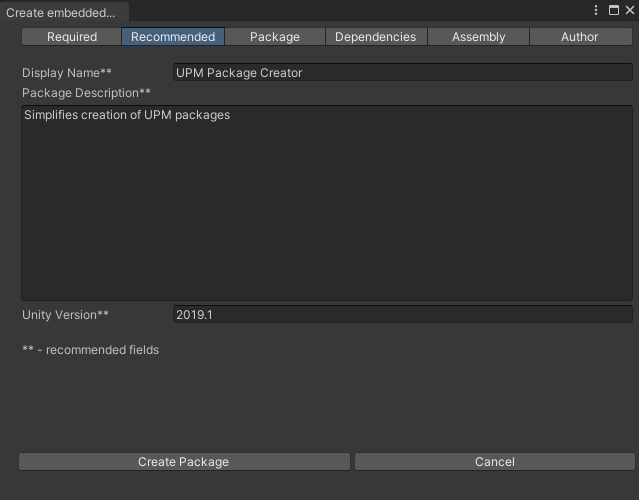
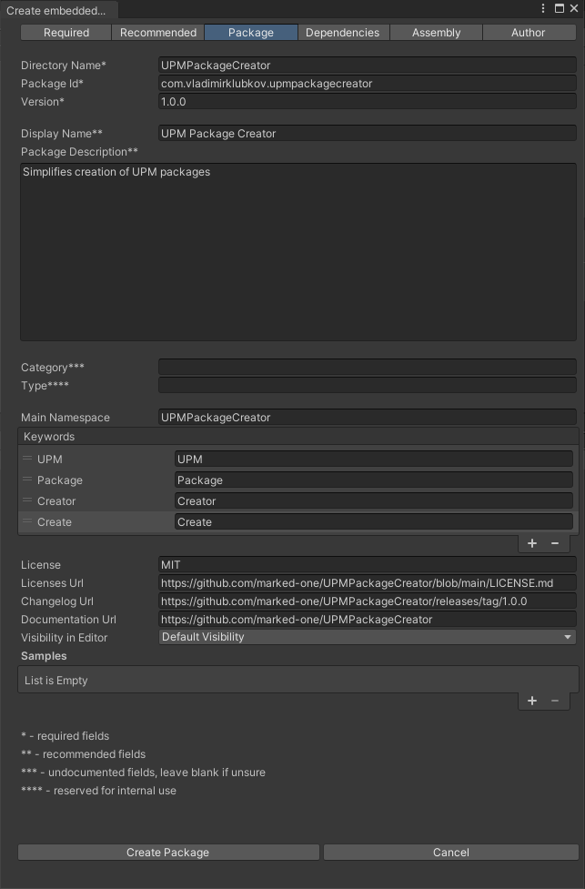

# UPM Package Creator for Unity

## About

This is an Editor tool that simplifies creation of UPM packages.

## License

[MIT License](../LICENSE.md)

## Installation

- Option 1: via Package Manager, press the + button and select `Add package from git URL..`, then paste `https://github.com/marked-one/UPMPackageCreator.git`. Or use the format `https://github.com/marked-one/UPMPackageCreator.git#1.0.0` to target a particular version (1.0.0 in this case).

- Option 2: clone or download this repository. Via Package Manager, press the + button and select `Add package from disk..`. Then target the `package.json` manifest.

- Option 3: clone or download this repository and move the folder to `<your Unity project>/Packages` folder.

## Tutorial

### Basic

#### 1. Open the desired wizard from the main menu:

  

  - Embedded package is a package created in the `Packages` folder of your project. Embedded package can be put under version control.
  - Assets folder package is created in the `Assets` folder of your project. This can be used as a destination for package development.
  - Local package is put on your local drive outside of your Unity project.

#### 2. Fill the [required](https://docs.unity3d.com/Manual/upm-manifestPkg.html#required) fields:

  

  Required tab displays the minimal amount that enable package creation.

  - `Directory Name` is the name of the package directory.
  - `Package Id` is the package name in format `<domain>.<author>.<package>` e.g., `com.vladimirklubkov.upmpackagecreator`
  - `Version` is the package version in the format `<major>.<minor>.<patch>` e.g., `1.0.0`

  `Create Package` button becomes enabled after these three fields are filled.

#### 3. Optionally, fill the [recommended](https://docs.unity3d.com/Manual/upm-manifestPkg.html#mandatory) fields:

  

  - `Display Name` is the package name displayed in Unity editor.
  - `Package Description` is the description of the package in a free form.
  - `Unity Version` is the minimal target version of Unity Editor without the Release version e.g., `2019.1` and not `2019.1.0f1`.

#### 4. Press the `Create Package` button:

  The minimal package (only containing `package.json` manifest) is created.

### Advanced example

#### 1. Packages tab

  [Documentation](https://docs.unity3d.com/Manual/upm-manifestPkg.html)

  

#### 2. Dependencies tab

  [Documentation](https://docs.unity3d.com/Manual/upm-manifestPkg.html)

  

#### 3. Assembly tab

  [Documentation](https://docs.unity3d.com/Manual/ScriptCompilationAssemblyDefinitionFiles.html)

  

#### 4. Author tab

  [Documentation](https://docs.unity3d.com/Manual/upm-manifestPkg.html)

  
